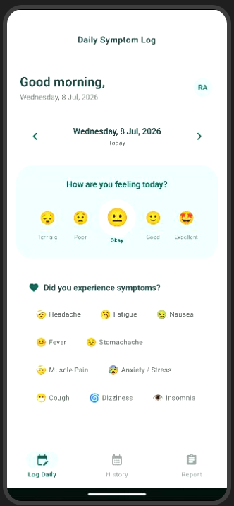
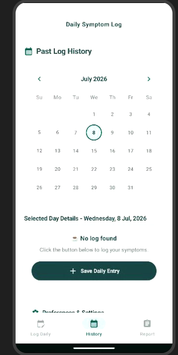
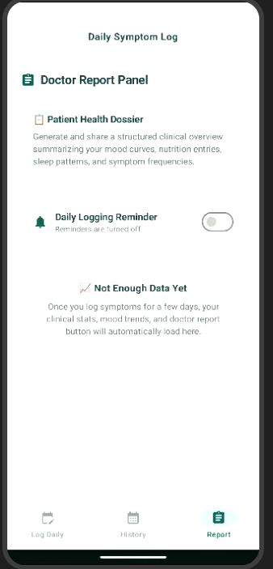

# 🏥 AppHealth - Symptom & Wellness Tracker

<div align="center">

[](https://developer.android.com)
[](https://kotlinlang.org)
[](#)

</div>

A modern Android application for tracking daily symptoms, mood ratings, and wellness data with clean architecture using the MVVM + Repository pattern.

---

## ✨ Features

### 📋 Symptom Tracking
- Record daily symptoms with multi-select support
- Track pulse rate, blood glucose levels, and weight measurements
- Optional notes field for additional context

### 😊 Mood & Sleep Monitoring  
- Rate your mood from 1 (Terrible) to 5 (Excellent)
- Track sleep quality and duration
- Comprehensive wellness data collection

### 🏗️ Clean Architecture
- **MVI Pattern**: Unidirectional data flow with predictable state changes
- **Repository Pattern**: Abstracted data access layer separating concerns
- **Room Database**: Local persistence with type-safe queries
- **Dependency Injection**: Factory pattern for easy dependency management

---

## 🎯 Project Structure

```
app/src/main/java/com/example/
├── MainActivity.kt          # Entry point
└── data/
    ├── SymptomLogEntry.kt   # Data model (Room entity)
    ├── SymptomLogDao.kt     # Room DAO interface
    ├── SymptomLogDatabase.kt # Database configuration & schema
    ├── SymptomLogRepository.kt # Repository abstraction + implementation
    └── SymptomLogConverters.kt # Type converters for lists
```

---

## 🚀 Getting Started

### Prerequisites
- [Android Studio](https://developer.android.com/studio) (Arctic Fox or newer recommended)
- JDK 17+
- Android SDK 34 (API level 34)

### Installation Steps

1. **Clone the repository**
   ```bash
   git clone <repository-url>
   cd app-health
   ```

2. **Set up environment variables**
   - Create a `.env` file in the project root
   - Add your configuration values (e.g., `GEMINI_API_KEY`)
   - See `.env.example` for reference

3. **Open in Android Studio**
   - Select **Open** and choose the project directory
   - Allow Android Studio to fix any incompatibilities during import

4. **Remove debug signing**  
   Edit `app/build.gradle.kts` and remove:
   ```kotlin
   signingConfig = signingConfigs.getByName("debugConfig")
   ```

5. **Run the app**
   - Connect an emulator or physical device
   - Click ▶️ Run in Android Studio

---

## 📱 Key Features Explained

### Repository Pattern Implementation
The `SymptomLogRepository` provides a clean abstraction over data access:

```kotlin
class SymptomLogRepositoryImpl(
    private val symptomLogDao: SymptomLogDao,
    private val db: RoomDatabase? = null  // Optional for caching
) : SymptomLogRepository {
    
    override suspend fun insertLog(entry: SymptomLogEntry): InsertResult { ... }
}
```

### Error Handling with Sealed Classes
Results use sealed classes instead of exceptions:
```kotlin
sealed class InsertResult {
    data object Success : InsertResult()
    data class Failure(val message: String) : InsertResult()
}
```

---

## 🛠️ Technical Stack

| Technology | Purpose |
|------------|---------|
| **Kotlin** | Primary programming language |
| **MVVM + MVI** | Architecture pattern for clean UI logic |
| **Room Database** | Local data persistence |
| **Repository Pattern** | Abstracted data access layer |
| **Factory Pattern** | Dependency injection support |

---

## 📦 Dependencies

```kotlin
// In app/build.gradle.kts
implementation("androidx.room:room-runtime:2.6.1")
implementation("androidx.room:room-ktx:2.6.1")
implementation("androidx.lifecycle:lifecycle-viewmodel-compose:2.8.4")
implementation("org.jetbrains.kotlinx:kotlinx-coroutines-android:1.9.0")
```

---

## 📁 Project Files

| File | Description |
|------|-------------|
| `MainActivity.kt` | Application entry point with Activity Compose setup |
| `SymptomLogEntry.kt` | Data model representing a symptom log entry |
| `SymptomLogDao.kt` | Room DAO interface for database operations |
| `SymptomLogDatabase.kt` | Database configuration, schema creation, and migration |
| `SymptomLogRepository.kt` | Repository abstraction with production implementation |
| `SymptomLogConverters.kt` | Type converters for storing lists in SQLite |

---

## 🎨 Architecture Highlights

1. **Single Responsibility**: Each file has one clear purpose
2. **Testability**: Repository interface can be mocked for unit testing
3. **Maintainability**: Clean separation between UI, business logic, and data layers
4. **Scalability**: Easy to add new features without modifying existing code

## App Screenshots

<p align="center">
  
  
  
</p>

---

## 📝 License

This project is licensed under the Apache License 2.0 - see the LICENSE file for details.